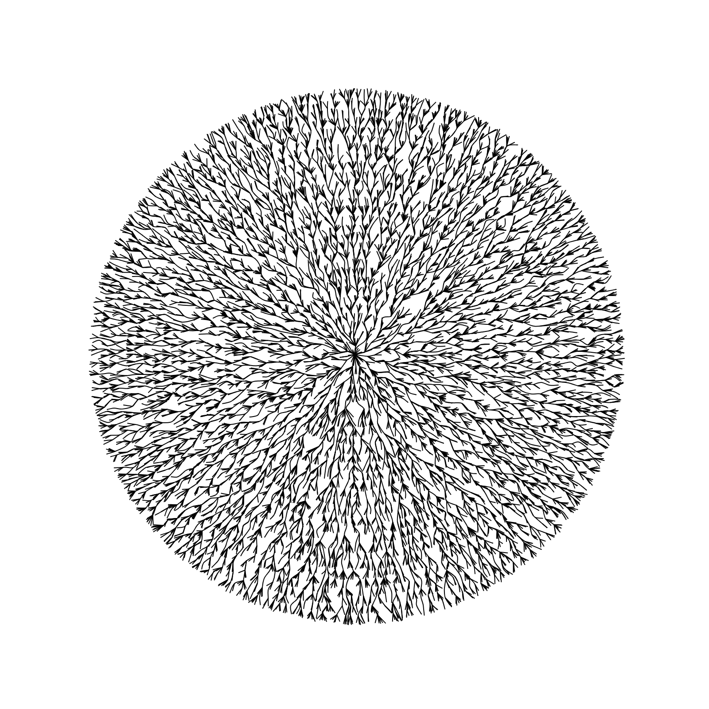

# Generative 2D Graphics Examples with p5.js 

## Description

This is a repository of generative graphics examples produced with [p5.js](https://p5js.org/). All images are plotted
in browser and can be saved as SVG. The examples provided may copy or utilize publicly available code.
Inspirations mostly include [Johan Karlsson](https://codepen.io/DonKarlssonSan) works 
([GitHub](https://github.com/DonKarlssonSan)). 

## License

MIT License.

## Usage

Open any of the provided HTML files in a browser, change the parameters in corresponding js file if necessary.
SVG files can be saved unless the following lines of code in each corresponding js file are commented out:

```js
svg = new p5(sketch, "svg_image");
svg.type = "SVG";
```

## Examples 

These examples correspond to the code which is either partially or fully original.

### Circular Tree Graph



### Voronoy Diagram Cells


